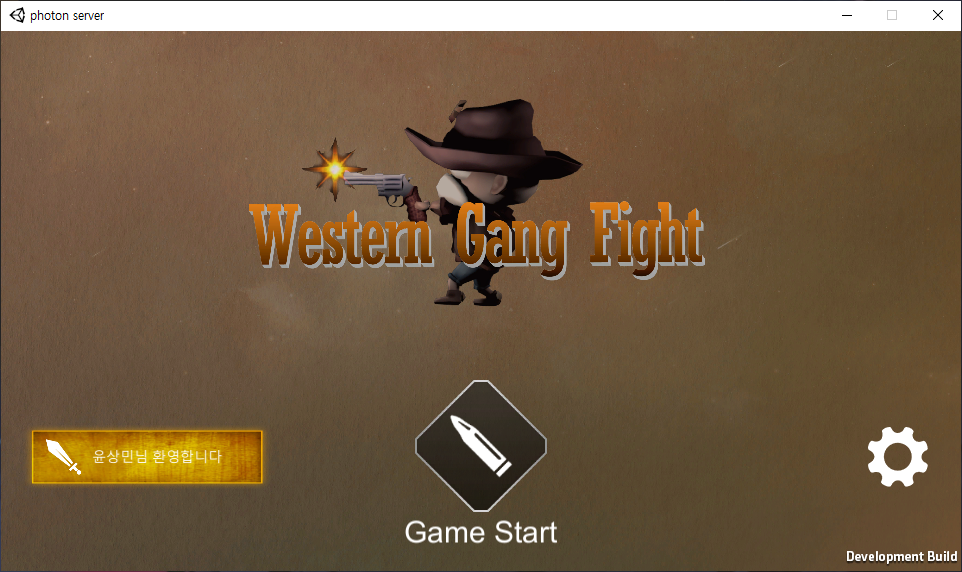
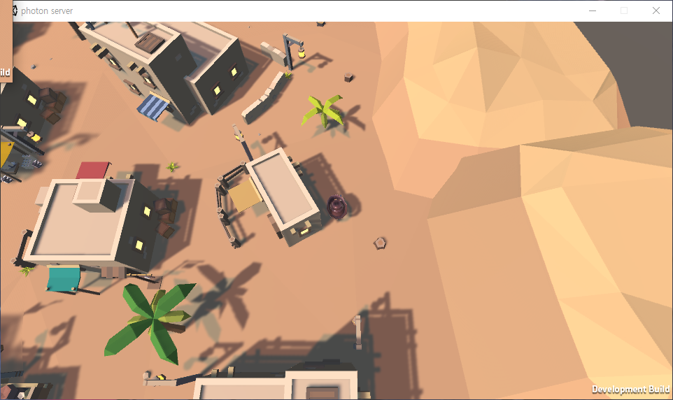
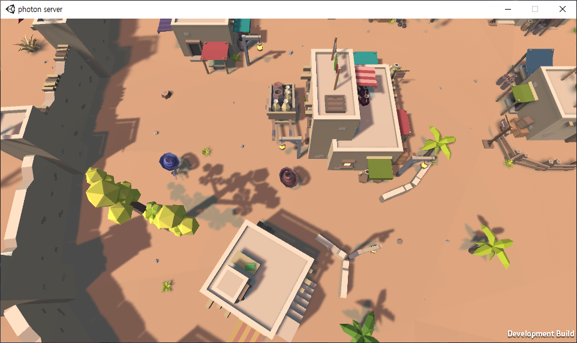
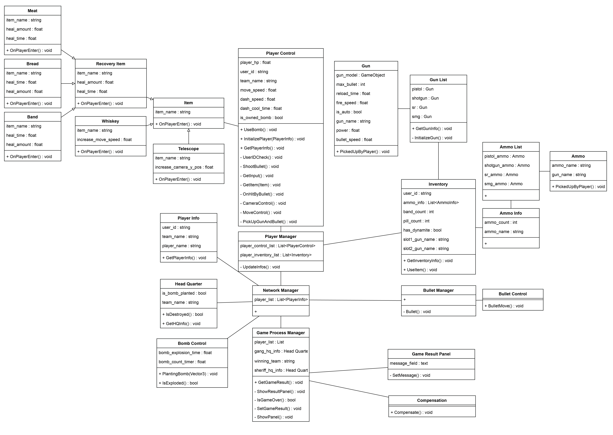
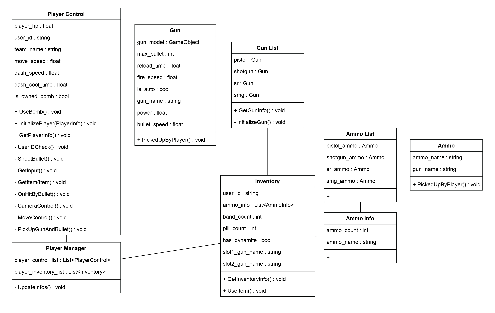
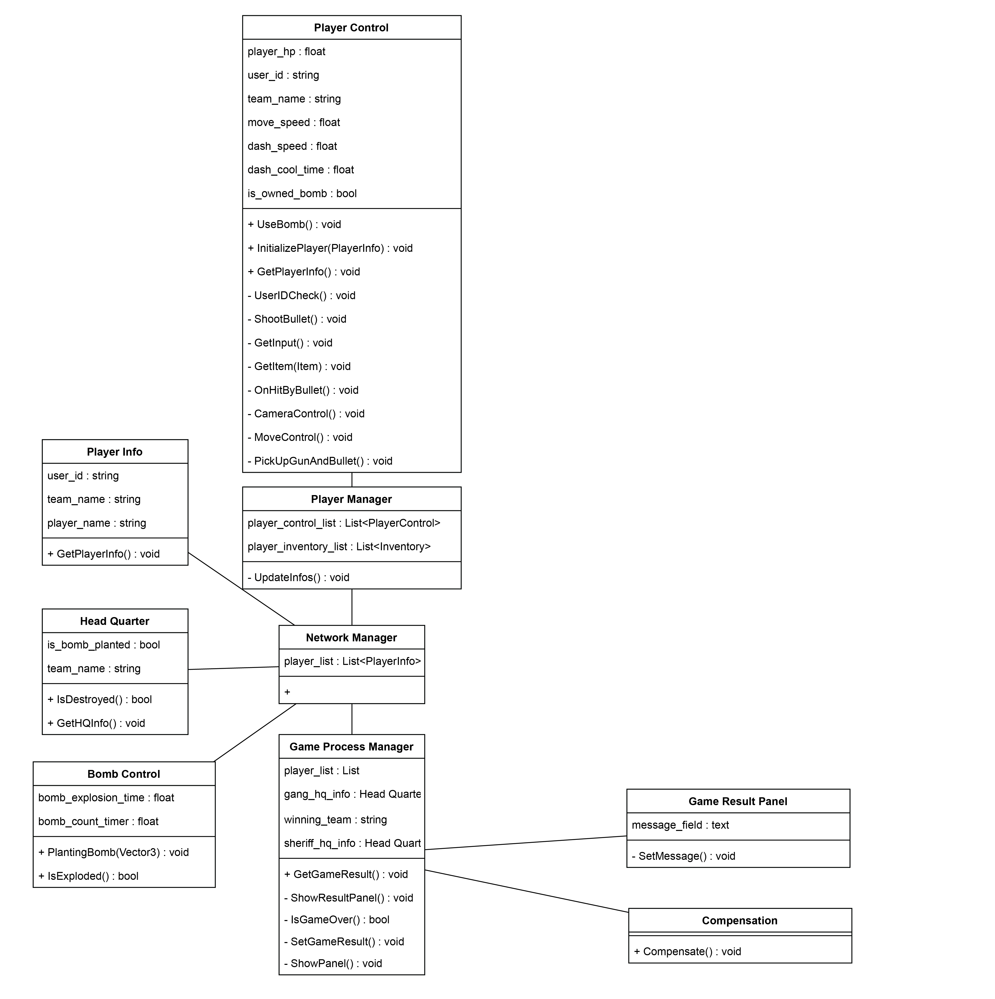
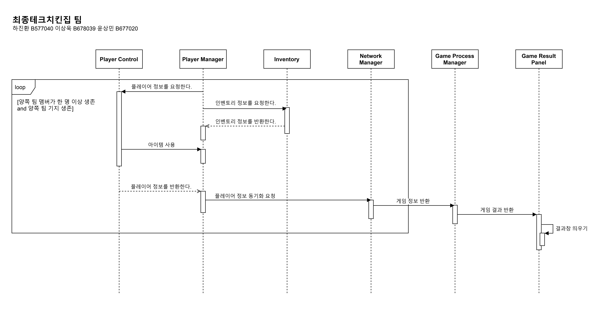

# Western Gang Fight

## 👉게임 개요

**[게임 이름 : Western Gang Fight]**  
**[장르 : 탑 뷰 멀티 슈팅 게임]**  
**[사용 도구 : Unity 3D, Photon Unity Networking]**  
**[목적 : 클래스 다이어그램을 이용한 설계와 협업 경험]**  
**[제작 기간 :  2021.05 - 2021.06]**  
**[제작 인원 : 3명 (프로그래머 2명)]**  
**[담당 업무 : 게임 기획, 클래스 다이어그램 작성, 프로토타입 구현]**  

## 👉구현 내용

 * ✔ Photon 서버를 이용한 방 생성과 랜덤 매치 구현

 * ✔ 플레이어 이동 서버 연동

 * ✔ 프로토타입 단계까지 구현

## 👉게임 이미지

## 👉게임 클래스 다이어그램

<전체 클래스 다이어그램>

<플레이어 컨트롤과 인벤토리 클래스>

<게임 프로세스 클래스 다이어그램>

## 👉시퀀스 다이어그램

<게임 진행 시퀀스 다이어그램>

<플레이어 시퀀스 다이어그램>

### 클론 후 lfs로 관리 중인 file 다운로드 필요
`git lfs pull`
